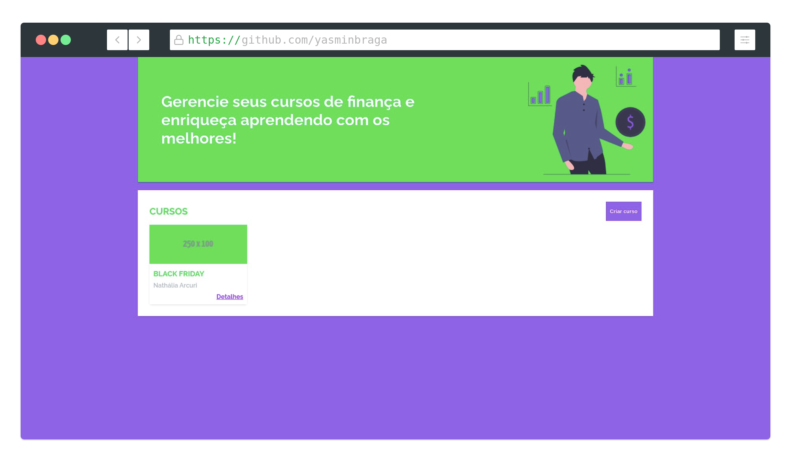
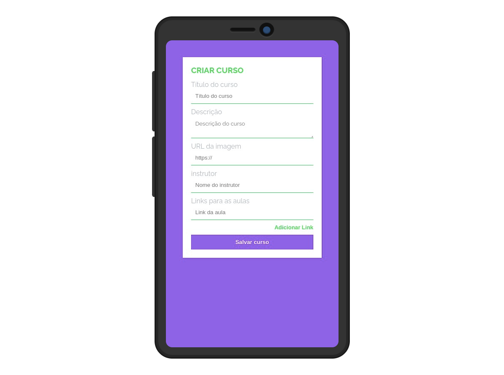
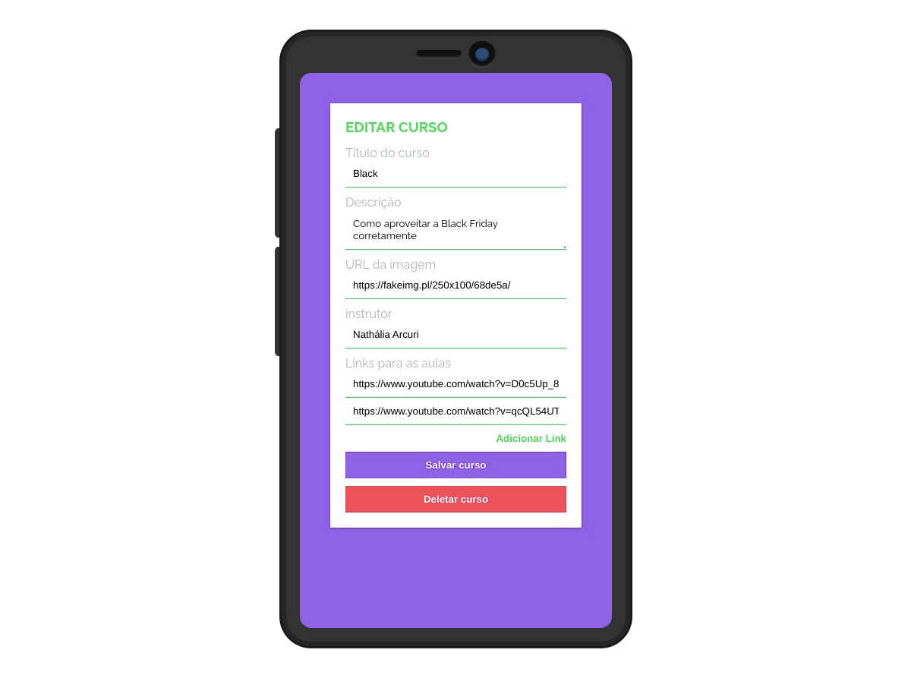

# Projeto Plataforma de Curso de Finanças

Este repositório consiste na solução para o desafio proposto no curso de desenvolvimento Full Stack da plataforma GamaAcademy.

## Overview

### O desafio

A proposta era a criação de uma plataforma de cursos sobre Educação Financeira em Javascript.

## Conceitos trabalhados

- HTML
- CSS
- Javascript
  - Manipulação de arrays
  - Manipulação de dados em documentos JSON
  - Roteamento

## Features Disponíveis

- Visualizar todos os cursos
- Visualizar detalhes de um curso
  
- Criar curso
  
- Editar curso
- Deletar curso
  

Made with :heart: by [Yasmin Braga](https://github.com/yasminbraga)
